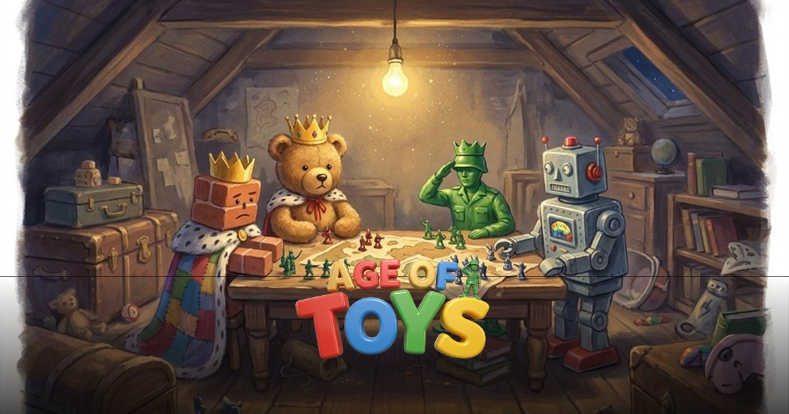
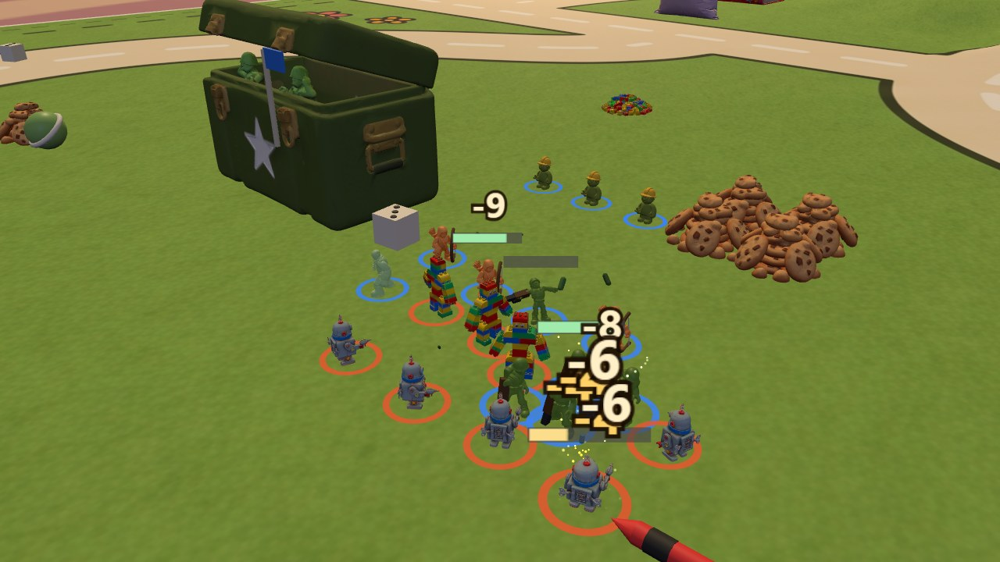
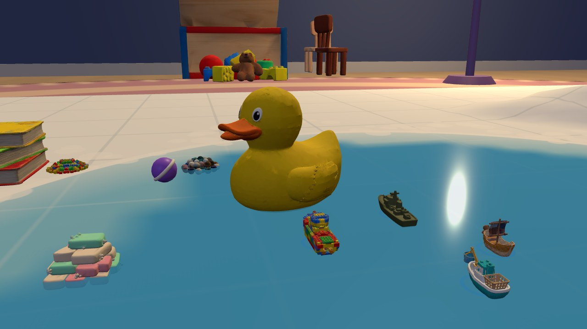
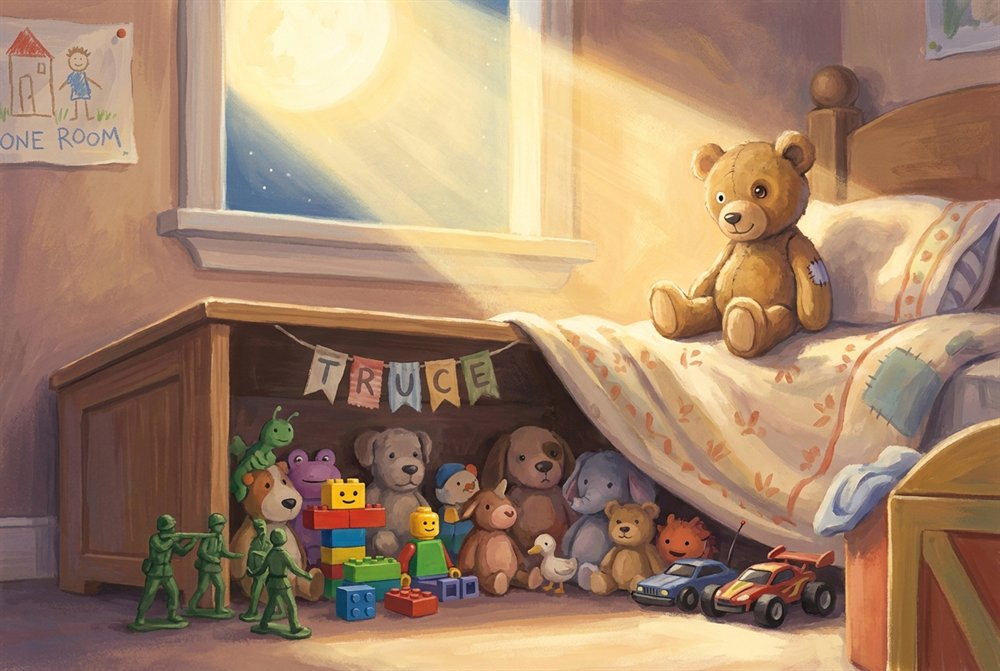

  

<h1 align="center">Age of Toys — After Bedtime</h1>

<b>A storybook real-time strategy game, free in your browser.</b> 
When the last light clicks off, five toy tribes wake up and go to war for the bedroom.

<a href="https://kylefriesmarketing.github.io/toybox-tactics/"><b>▶ &nbsp;PLAY NOW — no install, no account</b></a>

---

## What it is

A full Age-of-Empires-style RTS that fits in a toybox: gather snacks and blocks, raise houses and forts, age up from the Naptime Age to the Fort Age, and out-fight four rival toy tribes — then do it at sea, because the bathtub is a war zone too. Every battle is narrated like a bedtime story, and the opening is read aloud by a storyteller.

| | |
|---|---|
|  |  |

## Features

- **Five tribes, five ways to fight** — Classic Toys, Snap-Bricks, Plushie Horde, RC Racers and Tin Bots, each with unique units, buildings, houses, workers, warships, techs and a painted commander with a story.
- **A three-act illustrated campaign** — *The Bedroom Wars*, *The Sleepover*, and *The Yard Sale*: fifteen missions with hand-painted briefing plates, told entirely in storybook prose. Finish all three acts, and the book grows one more page.
- **Naval warfare** — build a Dock, send Bath Skimmers to net floating soap and bath pearls, then launch your tribe's warship. The rubber duck is not a combatant. Probably.
- **A bedtime narrator** — reactive story beats as you play (comebacks, booms, first fleets), a narrated intro cutscene, and a generated "story of your game" after every match.
- **The Storybook Codex** — an in-game illustrated encyclopedia with lore for every toy, building, tribe and battlefield.
- **9 battlefields + random maps** — from the Kitchen Table's milk lakes to Bookshelf Heights' terraced high ground, plus seeded random map generation.
- **4 game modes** — Conquest, Regicide, King of the Hill, Sudden Death; skirmish up to 4 players (FFA or teams) vs 3 AI difficulties with distinct personalities.
- **Online multiplayer** — deterministic lockstep 1v1 over peer-to-peer, with host/join codes. No servers, no accounts.
- **The full RTS kit** — control groups, attack-move, patrol, formations, stances, garrisons, town bell, veterancy, elite upgrades, trade routes, a dynamic market, save/load, and post-game timeline graphs.

  

## Controls

| | |
|---|---|
| **Left click / drag** | select (double-click: select all of a type) |
| **Right click** | move · gather · attack · build · garrison |
| **WASD / arrows / edges** | camera |
| **F** attack-move · **Z** patrol · **G** attack-ground | combat orders |
| **H** Toy Chest · **.** idle worker · **B** town bell | economy |
| **Ctrl+1–9** | control groups |
| **F6 / F7** | save / load |
| **ESC** | menu · **M** mute |

## Under the hood

- **Three.js** single-page app — no build step, no framework, ES modules.
- Deterministic fixed-tick simulation; multiplayer is lockstep command-passing over **PeerJS** (both machines simulate, only inputs travel).
- All 3D models, illustrations, portraits and narration are AI-generated (Higgsfield pipeline), then Draco-compressed — ~75 models in ~35 MB.
- The campaign prose, lore codex, taunts and the match storyteller were written by **Claude (Fable 5)**, which also built the game.

---

<i>The story doesn't end — it just goes to sleep. And every kid in the world knows what toys do while you're sleeping.</i>

